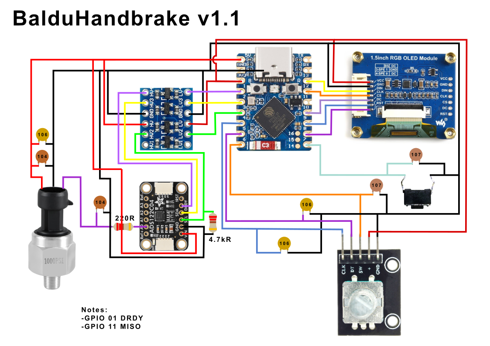
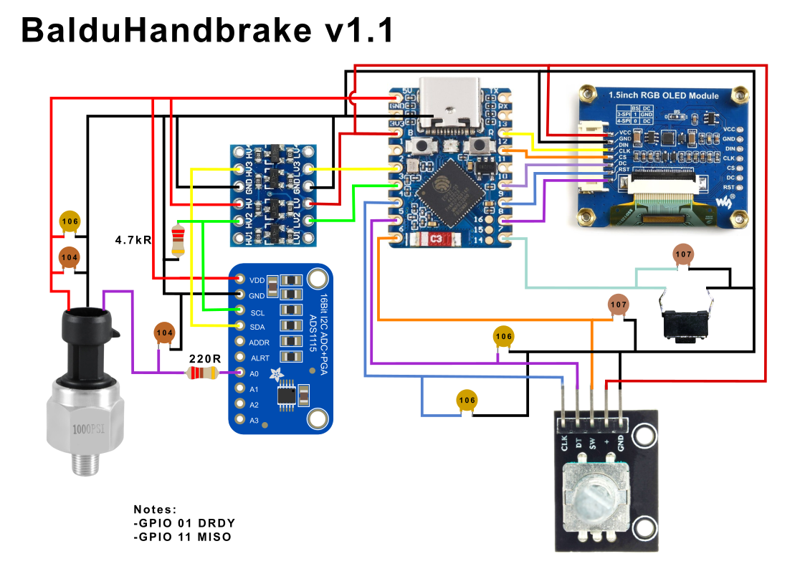
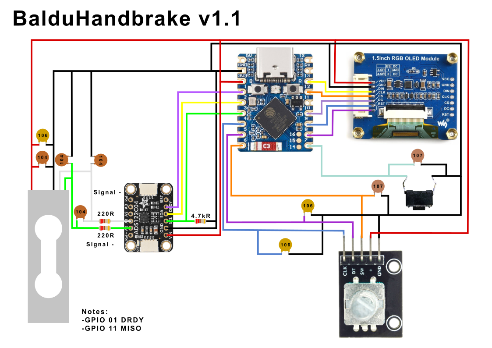
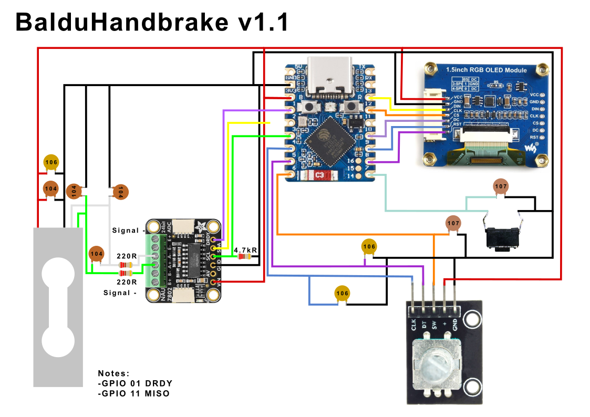
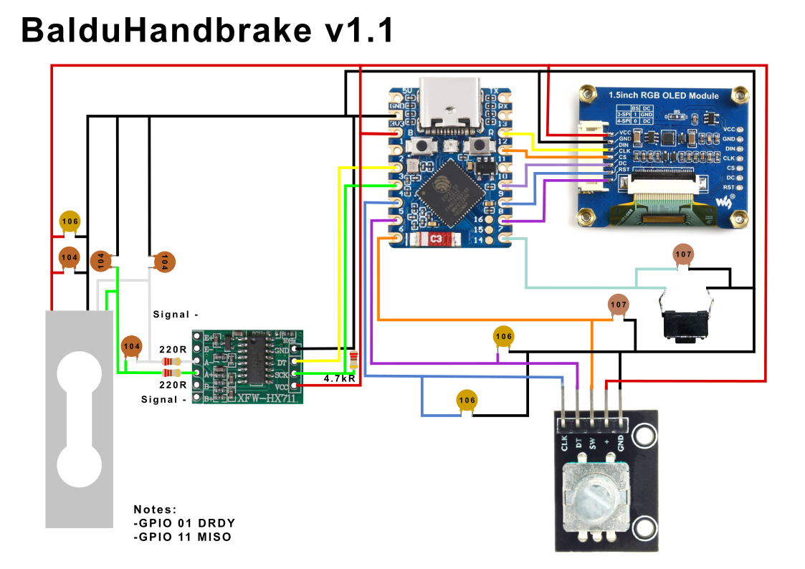

# BalduHandbrake

A simracing handbrake project.

## What Is This?

This project is focused on developing a flexible platform for making custom, high performance, handbrakes for simracing. It is composed of a hardware reference side and a flexible, feature rich and highly customizable software side.

### Hardware

 The hardware turns a real hydraulic handbrake mechanism into a high-performance USB HID joystick input for racing simulators. The handle operates a master and slave brake cylinders against elastic bushings or springs. Measurements are taken from a pressure transducer on the fluid line. This provides precise, analog position sensing — no potentiometers, no hall sensors, no mechanical wear on the sensing element.

It is assembled from common autoparts, plus some folded metal sheets and 3D printed parts. While I use a PCB for integrating the electronics, you could easily use a protoboard or simply solder the components for easy assembly. While all hardware is open sourced, it should be taken as a reference design, as the software is highly flexible and the spirit is to enjoy developing the hardware solution as the software is feature rich and super flexible.

The device presents itself to the PC as a standard HID joystick with one Z-axis (0–4095 resolution), which is the standard for simracing analog handbrake input. It also includes a momentary button which is generally used for the hold function. But has the option to incorporate that function directly into the firmware, for titles that lack that functionality. The device has an included user interface using an integrated 1.5" color OLED screen and a rotary encoder. This allows to customize the response curves in real time, without having to use custom software which requires you to leave the game. It also allows for full customization, including curves, deadzones, calibration, display screens, language and allows to save and load custom profiles.

### Software

The software project is fully open sourced under an Apache 2.0 license. It has been designed to work with either a pressure transducer or a load-cell mechanism, and supports multiple ADC. The development platform was developed with a 5V 500psi pressure transducer using an ADS1115, but ADS122C04 is also supported for pressure transducer. In load cell mode, ADS122C04, NAU 7802 and HX711 are supported, but need actual testing.

The code base is highly abstracted, allowing for easily adding sensor models, languages, correction curves and more. The 128 x 128 OLED and rotary encoder are currently a must, but that's what enables the full usability of the system.

### Key Features

- **1000 Hz USB polling rate** — deterministic sensor-to-USB pipeline on a dedicated CPU core, matching the maximum USB HID polling rate.
- **Six selectable response curves** — switchable live during gameplay via the rotary encoder, so you can adjust feel on the fly for different conditions (rally stages, drift, wet weather).
- **Pressure or load force sensing** — The platform allows for compile time customization for any 5V pressure transducer or load cell supporting the ADS115, ADS122C04, NAU7802 and HX711. While tested on 500 PSI transducer on the brake fluid line to provide smooth, repeatable input with natural damping, it is easily adapted to other pressure ranges or load cell design with the correct ADC and wiring change.
- **On-device configuration** — 128×128 OLED screen with rotary encoder for full device setup without any PC software.
- **5 saveable profiles** — store and recall complete configurations for different cars or disciplines
- **Firmware hold mode** — optional axis lock at 100% on button press, handled either by the game or by the device firmware.
- **Configurable deadzones, debounce, and refresh rates** — all adjustable from the on-device menu.
- **On-device calibration** — guided calibration routine with settling detection and outlier rejection.
- **Multi-language UI** — string table architecture ready for localization (English and Spanish included).

## Hardware

### Components

| Component | Model | Interface |
|---|---|---|
| Microcontroller | Waveshare ESP32-S3 Zero | USB |
| ADC | <ul><li>ADS1115 (16-bit, 860 SPS)</li><li>ADS122C04 (24-bit, 2000 SPS)</li><li>NAU7802 (24-bit, 320 SPS)</li><li>HX711 (24-bit, 80 SPS)</li></ul>  | I²C<br/><br/><br/>*(HX711 uses a proprietary 2-wire bus)*|
| OLED Display | SSD1351 (128×128, RGB) | SPI |
| Pressure Transducer | Ejoyous 0–500 PSI, 1/8 NPT | Analog (0.5V–4.5V) |
| Load Cell | Any load cell working at less than 5V | Analog (0V-5V) |
| Rotary Encoder | EC11 with pushbutton | GPIO |
| Hold Button | Momentary pushbutton (pommel-mounted) | GPIO |

### Pin Assignments (Waveshare ESP32-S3 Zero)

#### Hardware V1.0 (deprecated)

The original hardware design was done on traditional 

| Function | GPIO |
|---|---|
| Hold Button | 4 |
| Encoder Channel A | 5 |
| Encoder Channel B | 13 |
| Encoder Button | 3 |
| OLED CS | 10 |
| OLED DC | 6 |
| OLED RST | 7 |
| OLED SCK | 12 |
| OLED MOSI | 11 |
| I²C SDA | 8 |
| I²C SCL | 9 |

#### Hardware V1.1

Hardware V1.1 is compatible with all ADCs, enables Data Ready pin for reduced latency, is ready for an SPI OLED that has MOSI line and, more importantly, has data lines that do not cross in a signal plane, for simplified PCB and wiring designs. It also enables for a custom PCB to expose the ESP32-S3 Zero's GPIO pins 17, 18, 38, 39, 40, 41, 42 and 45 which could allow for an additional I²C and SPI channels, or any other custom application.



| Function | GPIO |
|---|---|
| DRDY (Optional) | 1 |
| I²C SDA or DOUT  | 2 |
| I²C SCL or SCK | 3 |
| Encoder Channel A/CLK | 4 |
| Encoder Channel B/DT | 5 |
| Encoder Button | 6 |
| Hold Button | 7 |
| OLED RST | 8 |
| OLED DC | 9 |
| OLED CS | 10 |
| OLED MISO (Optional) | 11 |
| OLED SCK | 12 |
| OLED MOSI | 13 |

### Schematics

Here we present five reference design on the Hardware V1.1 pin assignment. We offer this as reference points, but pin assignments can be changed in `config.h` and the ESP32-S3 Zero has excellent pin flexibility.

In general we use 104 and 106 capacitors as noise filters on the lines. We also add a 220 Ohms resistor between the sensor and the ADC to protect it from transients. The 4.7k Ohms resistor between the ADC SCL/SCK and ground is a pull down resistor because GPIO 3 is used during the booting process and if the pad floats high while GPIO is held low, it could put the CPU in `UART0_BOOT` mode, preventing it from booting normally.

#### ADS1115 — Pressure Transducer
This is the original development platform and the easiest to source and wire as the ASD1115 is widely available and very easy to use, regardless of its 860SPS limitation, lack of DRDY pin and the fact that it can't take VADD as reference.

**Important:** Please note that the 5V pressure transducer requires the use of a logic level converter between the ADC and the ESP32-S3 Zero, as the latter lacks 5V tolerance on its pins.



#### ADS122C04 — Pressure Transducer
This is the preferred platform for the pressure transducer sensor. It offers up to 2000SPS (we only use 1000SPS as it already saturates the USB HID capabilities), has a DRDY pin to avoid snooping the I²C bus to check for new samples. It also offers the option to take the VADD as reference, which allows for truly ratiometric measures, improving sample precision.

**Important:** Please note that the 5V pressure transducer requires the use of a logic level converter between the ADC and the ESP32-S3 Zero, as the latter lacks 5V tolerance on its pins.


#### ADS122C04 — Load Cell
This is the preferred platform for the load cell sensor. It offers up to 2000SPS (we only use 1000SPS as it already saturates the USB HID capabilities), has a DRDY pin to avoid snooping the I²C bus to check for new samples. It also offers the option to take the VADD as reference, which allows for truly ratiometric measures, improving sample precision.



#### NAU7802 — Load Cell
This is a good platform for the load cell sensor. It has a DRDY pin to avoid snooping the I²C bus to check for new samples, plus a register to avoid taking duplicate measures. It also offers the option to take the VADD as reference, which allows for truly ratiometric measures, improving sample precision. Regrettably, it only tops sampling at 320SPS, below the USB HID capability of 1000Hz. But for the price and quality is an excellent choice for a handbrake where the natural response is closer to 50~100Hz.



#### HX711 — Load Cell
While highly available, we offer this only as reference as we consider the HX711 80SPS too slow for the level of performance that we expect from the rest of the components. Instead of a I²C bus, the HX711 has a proprietary bus which is slow, it lacks a dedicated DRDY pin (data ready is signaled through the shared DOUT line), does not take VADD as reference and needs a reset after each change of settings. Also, differently from the ADS122C04 and NAU7802, the HX711 HX711 cannot do ratiometric measurement , which means a much nosier measure. But it can be an easy way to develop and test your first design, so we offer it as an option.



## Software

### Dual-Core Design

The ESP32-S3's two CPU cores are used to completely isolate the time-critical sensor pipeline from the UI:

**Core 0 — Sensor + USB (1000 Hz, deterministic)**
- Reads ADC (cached continuous mode value via I²C).
- Validates reading (transducer failure, over-pressure, low pressure detection).
- Computes informational PSI and voltage from transducer spec.
- Applies configurable deadzones.
- Applies selected response curve via precomputed lookup table with interpolation.
- Normalizes to 0–4095 Z-axis output.
- Reads and debounces the hold button.
- Sends USB HID report.

**Core 1 — User Interface (best-effort, ~10–30 Hz display refresh)**
- Polls rotary encoder (rotation + button with debounce).
- Runs the menu state machine.
- Renders the OLED display (partial updates to minimize SPI traffic).
- Manages NVS profile storage.

The cores communicate through a shared `LiveData` struct (Core 0 writes, Core 1 reads for display) and a `pendingConfig` + `configDirty` flag (Core 1 writes when user saves settings, Core 0 picks up changes). No mutex is needed — the data flow is unidirectional, and torn reads are cosmetically harmless at display refresh rates.

### Software architecture

The environment tries to use as much C as possible, reducing C++ syntax to the bare minimum. It also strives to use integer math where possible.

While the code is extensively commented, it's complex nature can be a bit daunting at first. If you are not comfortable with programming, you only need to know how to edit the `config.h` file. The rest of the explanation is for those that want to delve into the code.

#### Modules.

| File | Function |
|---|---|
| `assets.h` | All images are stored in this file as arrays. Please note that most arrays are 16bit color corresponding to the SSD1351 OLED display, so before you can manipulate the color data you have to separate it in the 5:6:5 RGB bits. |
| `BalduHandbrake.ino` | Here we have the initialization code, FreeRTOS tasks creation and distribution among the CPUs and shared state. |
| `config.h` | This is the main configuration and customization file. As a user you just need to configure it to your taste and ideally nothing else. |
| `curves.h` | This file stores the LUT tables for the response curves. These curves are precalculated and transform the linear response of the axis after the deadzones have been applied and the numbers reducer to 0-4095 final range. Then it's modified by the LUT tables to reach the desired response curve. Please read the [Response Curves Section](###response-curves) |
| `display.cpp/h` | Everything related to the OLED output is done in this files. It handles the display of the different screen modes, and the rendering of the menus.|
| `devices/` | The files in this directory are the shim drivers that abstract each different ADC. In that directory you will find an explanation of the interface contract that they have to comply with. |
| `hid.cpp/h` | Everything related to the USB connection and communication of the HID device. It also handles the momentary button. |
| `sensor.cpp/h` | (CPU0 bound) These files are the ones that handle the setup, configuration, sampling, smoothing and transformation of the ADC (i.e. the handle movement). |
| `storage.cpp/h` | This handles the NVRAM to store and read the saved profiles. But it just serializes data and reads and writes to memory whatever it is sent and requested. |
| `strtable.cpp/h` | All strings and available languages are in these files. Is the single point of interest for translations.  |
| `ui.cpp/h` | (CPU1 bound)This module is the handler of all interface tasks. It reads the rotary encoder data, processes menu positions, changes screens, and sends data to `display.cpp/h` for rendering and requests `storage.cpp/h` services. |

### Response Curves

Six response curves are available, switchable live during gameplay:

| Curve | Formula | Character |
|---|---|---|
| Linear | passthrough | Direct 1:1 mapping |
| Rally Soft | t^2.2 | Gentle initial response, progressive buildup |
| Rally Aggressive | t^0.75 | Strong initial bite, fine top-end control |
| Drift Snap | zero below threshold, then linear | Dead zone then immediate response |
| Wet | t^3.5 | Very soft initial response, prevents lockup |
| S-Curve | sigmoid | Soft at extremes, steep in the middle |

Curves that use mathematical functions are precomputed as 1025-entry lookup tables (1024 segments + sentinel for interpolation). The per-sample cost is a single array lookup with 2-bit fractional linear interpolation — no floating-point math in the sensor pipeline.

### Menu System

The device is configured entirely through the rotary encoder and OLED, with no PC software required.

**LIVE Mode** — Displays real-time sensor data. Four display styles:
- *Full Data* — PSI/Kgf, voltage, percentage, and progress bar.
- *Clean* — Large centered percentage.
- *Bar* — Arc gauge with percentage.
- *Dark* — Black screen, briefly shows curve name on change and hold mode.

In LIVE mode, rotating the encoder switches curves instantly. Holding the encoder button while rotating switches between LIVE display modes.

**Menu Navigation** — Click the encoder to enter. Four arrow buttons navigate between parameter screens (left/right) or return to LIVE (up) or enter editing (down).

**Value Editing** — The up/down arrows become Save (S) and Discard (X). Rotate to highlight adjustment buttons, click to change values. Save commits changes to the sensor pipeline immediately. Discard restores the previous values.

### Configuration Screens

- **Hold Mode** — Game (button click sent to PC) or Firmware (axis locked at 100% on click).
- **Deadzones** — Low and high deadzones, 0.0–20.0% in 0.1% increments.
- **Default Curve** — Boot-time curve selection.
- **Snap Threshold** — Drift Snap curve zero-region size (0.0–100.0%).
- **Button Debounce** — 5–200 ms.
- **Refresh Rates** — USB/ADC rate (250/475/860/1000 Hz) and display rate (10/15/20/30 Hz).
- **Calibrate** — Guided zero and max calibration with settling detection and outlier rejection.
- **Language** — English / Spanish (extensible via string table).
- **Quick Save** — Saves current state (including LIVE mode, calibration, etc) to the loaded profile.
- **Save & Load** — 5 profile slots with save, load, and status indication.


### Persistence

Configuration is stored in the ESP32's Non-Volatile Storage (NVS) using a data-driven field descriptor table. Adding a new configuration field requires exactly three changes:
1. Add the field to `DeviceConfig` in `config.h`
2. Set its default in `getDefaultConfig()`
3. Add one line to `CONFIG_FIELDS[]` in `storage.cpp`

Old saved profiles remain compatible — new fields load with their default values.

## Building

### Requirements

- Arduino IDE 2.x
- ESP32 board package by Espressif (Board Manager)
- Board selection: "Waveshare ESP32-S3-Zero"

### Libraries (install via Library Manager)

- **Adafruit TinyUSB** — USB HID
- **LovyanGFX** — OLED driver and graphic primitives
- **RotaryEncoder** by Matthias Hertel — Encoder input
- **ADS1X15** by Rob Tillaart — For the ADS1115 ADC
- **SparkFun_ADS122C04_ADC_Arduino_Library** — For the ADS122C04 ADC
- **SparkFun_Qwiic_Scale_NAU7802_Arduino_Library** — For the NAU7802 ADC
- **HX711** by Bogdan Necula — For the HX711 ADC

### Arduino IDE Settings

| Setting | Value |
|---|---|
| Board | Waveshare ESP32-S3-Zero |
| USB CDC On Boot | Enabled |
| CPU Frequency | 240Mhz (WiFi)
| USB DFU On Boot | Disabled |
| Events Run On | Core 1 |
| Flash Mode | QIO 80 Mhz |
| Arduino Runs On | Core 1 |
| USB Firmware MSC on Boot | Disabled |
| Partition Scheme | Default 4MB with spiffs |
| PSRAM | Enabled |
| Upload Mode | UART0 / Hardware DCD |
| Upload Speed | 921600 |
| USB Mode | USB-OTG (TinyUSB) |

### Upload Procedure

The Waveshare ESP32-S3 Zero uses native USB (no UART-to-USB chip). As we are reprogramming the USB definition to an HID joystick, windows will recognize it as a different device and thus, change the assigned COM port between programming mode and joystick mode. It will fail to upload after compiling and timing out due to it listening on the other COM port. Just select the other port (the one it originally assigned as ESP32-S3 Zero before uploading this sketch), and upload again. It will upload and reconfigure it to the joystick port.

Alternatively, to upload without having to wait, but you need physical access:

1. Disconnect the USB cable
2. Hold the BOOT button
3. Plug in the USB cable while holding BOOT
4. Release BOOT
5. Select the bootloader COM port in Arduino IDE
6. Click Upload
7. Press RESET after upload completes

## Customization

### Configuring the sensor

1. Check the voltages.
   #### Pressure Transducer
   Pressure transducers are usually 5V devices. As such, you need to also feed the ADC from the same 5V source. **Important**, The ESP32 might be damaged by 5V, thus *the I²C/DRDY connection must be done through the logic level converter*.

   #### Load Cells
   Load cells generally generate signals in the millivolts range. In this case, the ADC and the load cell are fed from the 3.3V rail and *thus the ADC must be directly connected to the ESP32 with no need for a logic level converter*.

   **Note on Polarity:** it's important that polarity is correctly done. If the signal positive and negative are inverted, you will see negative force and the system might ignore the signal or may throw an error. Please check that the positive signal (generally the green cable) is on the first channel (usually A0 or A+) and the negative signal (generally white color) is on the second channel (usually A1 or A-).
2. Select between the `SENSOR_PRESSURE_TRANSDUCER` and `SENSOR_LOAD_CELL` defines in `config.h`.
3. Check the correct pin definition for `I2C_SDA_PIN` and `I2C_SCL_PIN` for I²C based ADC, or `HX711_DOUT_PIN` and `HX711_SCK_PIN` for the HX711 in `config.h`. **Important**, for pressure transducer it needs to feed both the transducer and ADC from the 5V rail, which implies that the I²C/DRDY connection must be done through the logic level converter because the ESP32-S3 Zero can be damaged if fed a 5V signal. **But** load cells work best at 3.3V and thus the ADC and load cell should be fed by the same 3.3V rail, this also enables truly ratiometric measures in the ADS122C04 and NAU7802.
4. Set the sensor variables in `config.h`. *Note: all variables are **signed 16 bits integers** and thus should be rounded to the closest integer after calculations and checked to never be beyond the limits of ±32767.*

   #### Pressure transducer variables:
   |Variable|Notes|
   |-|-|
   |`SENSOR_UNIT_MAX`| This parameter is the maximum nominal pressure that the transducer is capable of in psi, e.g. 500, 1000, etc.|
   |`ADC_SPEC_ZERO`| This is the raw value when the pressure transducer reads zero pressure. The calculation is explained below.|
   |`ADC_SPEC_FULL`| This is the raw value at the pressure transducer read of maximum nominal pressure.|
   |`ADC_FAIL_THRESHOLD`| The raw value below which we assume the sensor is disconnected or failed. Since at 0psi the sensor signals 0.5V, we conservatively took half that voltage, i.e. 0.25V as the cutoff below which we make the assumption.|
   |`ADC_OVER_THRESHOLD`| The raw value above which the sensor is over pressuring or can't signal any further increase in pressure. For security, we need an upper bound where we assume that the pressure is beyond the sensor working margin. In the particular case of the 5V transducer, while the sensor physically could do at least 25% above nominal pressure without much consequence, it can't really signal above the fed voltage, 5V in our example. Since some voltage losses are expected, it probably could not go above 4.9V even if pressure was 50% above nominal. Thus, we used 4.82V as a threshold above which we assume an overpressure event.|

   #### Load Cell variables:
   |Variable|Notes|
   |-|-|
   |`SENSOR_ADC_GAIN`| The gain applied to the input channels. Defaults to 128, but you might want to reduce it if `ADC_SPEC_FULL` is more than 31000 |
   |`SENSOR_UNIT_MAX`| This parameter is the maximum nominal force that the load cell is capable of in kgf, e.g. 50, 100, 200, etc.|
   |`ADC_SPEC_ZERO`| This is the raw value when the handle is at rest. Initially set it to 0, then use the calibration function to obtain the true number and commit it to the `config.h`.|
   |`ADC_SPEC_FULL`| This is the raw value at the load cell's maximum nominal force.|
   |`ADC_FAIL_HIGH_THRESHOLD`| The raw value above which we assume the load cell is shorted. It should be close to the data type maximum value and comfortably above `ADC_SPEC_FULL`. Since we read raw at 16 bits, we set it to 31000, as 32767 is the maximum possible value.|
   |`ADC_FAIL_LOW_THRESHOLD`| The raw value below which we assume the load cell is shorted. It should be the negative mirror of `ADC_FAIL_LOW_THRESHOLD`. |

5. You need to calculate the `ADC_SPEC_ZERO` and `ADC_SPEC_FULL` and other variables of your sensor. We need to know what count the ADC will read raw at the maximum level and the zero level.

   #### Pressure transducer calculations
   In the pressure transducer case, we need to know what's the reference voltage of the ADC, and the gain, plus the transducer voltage for zero and maximum pressure.
   **Important:** Al numbers are *integer*, so you must round them before writing them into the `config.h` file.

   ```
   Pressure Transducer calculation for ADC calibration
   Definitions:
   V_0    = voltage at which your pressure transducer senses 0psi. 0.5V in our example.
   V_max  = voltage at which your pressure transducer senses its maximum pressure. 4.5V in out Ejoyus 500psi example.
   V_fail = voltage below which we assume transducer disconnection or failure. 1/2 of V_0 is a good choice.
   V_over = voltage above which the transducer can signal or might get damaged.
            It should be below the transducer VCC minus some losses but obviously above the transducer VCC 
   V_ref =  voltage fed to the pressure transducer VCC or + line. It's 5V in our Ejoyus 500psi example. 
   sensor_max = maximum number of the ADC resolution. It is 2^15-1 = 32767 since we use 16bit signed math.
   sensor_gain = gain set on the ADC.

   ADC_SPEC_ZERO = V_0 / V_ref * sensor_gain * sensor_max
   ADC_SPEC_FULL = V_max / V_ref * sensor_gain * sensor_max
   ADC_FAIL_THRESHOLD = V_fail/ V_ref * sensor_gain * sensor_max
   ADC_OVER_THRESHOLD = V_over/ V_ref * sensor_gain * sensor_max
   ```
   *Note: the ADS1115 is a special case because the way that it works is that while fed 5V and the nominal gain is 2/3, the actual reference voltage is 6.144V. So, replace* `V_ref * sensor_gain` *with 6.144V.*
   ``` 
   Example: ADS122C04
   V_0 = 0.5
   V_ref = 5V
   sensort_max = 32767
   sensor_gain = 1
   ADC_SPEC_ZERO = V_0 / V_ref * sensor_gain * sensor_max = 0.5 / 5 * 1 * 32766 = 3277
   ADC_SPEC_FULL = V_max / V_ref * sensor_gain * sensor_max = 4.5 / 5 * 1 * 32766 = 29490
   ADC_FAIL_THRESHOLD = V_fail/ V_ref * sensor_gain * sensor_max = 0.25V / 5 * 1 * 32766 = 1638
   ADC_OVER_THRESHOLD = V_over/ V_ref * sensor_gain * sensor_max = 4.82V / 5 * 1 * 32766 = 31586
   ```

   ``` 
   Example: ADS1115
   V_0 = 0.5
   V_ref * sensor_gain = 6.144V
   sensort_max = 32767
   ADC_SPEC_ZERO = V_0 / V_ref * sensor_max * sensor_gain = 0.5V / 6.144V * 32766 = 2667
   ADC_SPEC_FULL = V_max / V_ref * sensor_max * sensor_gain = 4.5V / 6.144V * 32766 = 24000
   ADC_FAIL_THRESHOLD = V_fail * sensor_gain * sensor_max = 0.25V / 6.144V * 32766 = 1333
   ADC_OVER_THRESHOLD = V_over * sensor_gain * sensor_max = 4.82V / 6.144V * 32766 = 25707
   ``` 

   #### Load cell calculations
   Load cell datasheets specify the *excitation output*. It's usually as small number like 2mV/V. This means that the rated capacity (like 100kgf, for example) will be that mV times the voltage of the VCC. For example, a 2mV/V powered from a 3.3V line and rated at 200kgf, will output 2mV/V * 3.3V = 6.6mV when stressed at 200kgf. That number is very small, so we generally use gain. How does it work? The sensor output will be multiplied by the gain. Let's use for example a gain of 128. Thus, the 6.6mV will be multiplied by 128. So, 6.6mV * 128 = 0.8448V.

   Load cells use a differential signal, i.e. it measures the difference between the signal + and -. So, it should always have 0V at rest. But handbrakes are mechanical devices that might have some force applied to the cell even when at rest from the user's point of view. Thus, for the zero or release position parameter, `ADC_SPEC_ZERO` should initially be set at 0. Then perform a calibration and write down the value to write it in the `config.h`.

   ```
   Load Cells calculation for ADC calibration
   Definitions:
   excitation = the specified excitation output of the load cell, measured in mV/V. 2mV/V in our example.
   V_exi = excitation voltage of the load cell, i.e. the voltage that powers the cell. In our example 3.3V.
   V_ref = voltage reference of the ADC, like VACC, Ref+ line, or an internal reference like 2.048V. In our example, also 3.3V for a ratiometric measure.
   sensor_max = maximum number of the ADC resolution. It is 2^15-1 = 32767 since we use 16bit signed math.
   sensor_gain = gain set on the ADC.
   ADC_SPEC_ZERO = use calibration function.
   ADC_SPEC_FULL = excitation * V_exi * sensor_gain * sensor_max / V_ref
   ```
   ```
   Example: ADS122C04_loadcell
   excitation = 2mV/V
   V_exi      = 3.3V
   V_ref      = 3.3V
   sensort_max = 32767
   sensor_gain = 128
   ADC_SPEC_ZERO = set to zero initially, then use the calibration value.
   ADC_SPEC_FULL = excitation * V_exi * sensor_gain * sensor_max / V_ref = 2mV/V * 3.3V * 128 * 32766 / 3.3V = 8388
   ADC_FAIL_HIGH_THRESHOLD = 31000 is more than 8388, so keep it.
   ADC_FAIL_LOW_THRESHOLD = - ADC_FAIL_HIGH_THRESHOLD = -31000
   ```
   ```
   Example: NAU7802
   excitation = 10mV/V
   V_exi      = 3.3V
   V_ref      = 3.3V
   sensort_max = 32767
   sensor_gain = 64     //Using 128 would overflow as it is 41840 >> 32766
   ADC_SPEC_ZERO = set to zero initially, then use the calibration value.
   ADC_SPEC_FULL = excitation * V_exi * sensor_gain * sensor_max / V_ref = 10mV/V * 3.3V * 64 * 32766 / 3.3V = 20970
   ADC_FAIL_HIGH_THRESHOLD = 31000 is more than 20970, so keep it.
   ADC_FAIL_LOW_THRESHOLD = - ADC_FAIL_HIGH_THRESHOLD = -31000
   ```
   ```
   Example: HX711
   excitation = 2mV/V
   V_exi      = 3.3V
   V_ref      = 2.56V //Fixed on the HX no matter the V_exi nor the VCC.
   sensort_max = 32767
   sensor_gain = 128 //HX711 only offers 32, 64 and 128
   ADC_SPEC_ZERO = set to zero initially, then use the calibration value.
   ADC_SPEC_FULL = excitation * V_exi * sensor_gain * sensor_max / V_ref = 2mV/V * 3.3V * 128 * 32766 / 2.56V = 10812
   ADC_FAIL_HIGH_THRESHOLD = 31000 is more than 10812, so keep it.
   ADC_FAIL_LOW_THRESHOLD = - ADC_FAIL_HIGH_THRESHOLD = -31000
   ```

### Configuring the ADC

1. Uncomment the desired sensor (ADC_ADS1115|ADC_ADS122C04|ADC_NAU7802|ADC_HX711) in `config.h`.
2. Check the correct pin definition for `I2C_SDA_PIN` and `I2C_SCL_PIN` for I²C based ADC, or `HX711_DOUT_PIN` and `HX711_SCK_PIN` for the HX711 in `config.h`. **Important**, for pressure transducer it needs to feed both the transducer and ADC from the 5V rail, which implies that the *I²C/DRDY connection must be done through the logic level converter because the ESP32-S3 Zero can be damaged if fed a 5V signal*. **But** since load cells work best at 3.3V and thus the ADC and load cell should be fed by the same 3.3V rail, this also enables truly ratiometric measures in the ADS122C04 and NAU7802. The HX711 cannot work that way and always uses a 2.56V internal reference. As the VCC can diverge by up to 5% between individual chips and temperature conditions, the actual values might diverge by that much and constant calibration is needed.
3. If you have wired the Data Ready pin, set the `ADS_DRDY_PIN` to the correct pin (suggested 1), else leave it at -1.
4. Check `I2C_WIRE_SPEED` define for your I²C ADC (400000 for 400kHz is the ESP32-S3 Zero maximum rating) `config.h`.
5. For the ADS1115 and ADS122C04 you can set the I²C address in the `ADS1115_ADDR` and `ADS122C04_ADDR` defines in `config.h`.
6. In the case of `SENSOR_LOAD_CELL` you can also lower the default `SENSOR_ADC_GAIN 128` if your `ADC_SPEC_FULL` overflows above 31000.

### Adding a Response Curve

1. Add a `CurveID` enum value in `config.h`
2. Add the curve name to `CURVE_NAMES[]` in `config.h`
3. Generate the LUT using the Python script in `curves.h` header comments
4. Add the LUT array to `curves.h` and update `CURVE_LUTS[]`
5. Update `curveToLutIndex()` in `config.h`
6. Handle the new case in `applyCurveCorrection()` in `sensor.cpp`

### Adding a Language

1. Add the `Language` enum value in `config.h`
2. Add a complete row to `STRING_TABLE[][]` in `strtable.cpp`
3. Add the language name to `LANG_NAMES[]` in `strtable.cpp`

Note: The SSD1351 with LovyanGFX does supports UTF-8, but most fonts only support 7-bit ASCII. Use unaccented approximations for non-English translations. Full Unicode support would require replacing the font.

### Adding a Configuration Parameter

1. Add the field to `DeviceConfig` in `config.h`
2. Set its default in `getDefaultConfig()` in `config.h`
3. Add one line to `CONFIG_FIELDS[]` in `storage.cpp`

Existing saved profiles will load the new field with its default value automatically.

### Adding a new ADC
Adding a new ADC is relatively straightforward. Practically everything is limited to the shim driver. Please consult the [devices README](devices/README.md) on what you need. But keep in consideration that while the bus initialization happens in the shim, the ESP32-S3 has four SPI controllers, only two are available.

1. Write a new shim driver and add it to `devices/`.
2. Add a new `#define` in `config.h` of the form ADC_SENSORNAME and put it next to the other defines.
3. Add a new `#elif defined(ADC_SENSORNAME)` to `ADS_SENSOR_NAME` in `sensor.h` with your sensor name.
4. Add a new `#elif defined(ADC_SENSORNAME)` to `#include "devices/shimname.h"` in `sensor.ccp`.
5. If your sensor is for a load cell, add the error check for `SENSOR_LOAD_CELL` in `sensor.cpp` of the form:
   ```
   #if defined(ADC_SENSORNAME) && !defined(SENSOR_LOAD_CELL)
      #error "SENSORNAME requires SENSOR_LOAD_CELL"
   #endif
   ```
6. Add an address define or custom pin names defines if your ADC have them in the ADC ELECTRONIC PARAMETERS section of `config.h`.
7. If your ADC cannot reach close to 1000SPS, add the `DEFAULT_SAMPLE_RATE_HZ` in the DEFAULT BEHAVIOR section of `config.h`.

## Hardware Notes

### Calibration

The on-device calibration routine:
1. Prompts the user to release the handle, detects settling (readings stable within a configurable band)
2. Collects 500 samples over 5 seconds, sorts them, rejects the top and bottom 5% as outliers, and averages the remainder to establish the zero point
3. Repeats the process with the handle pulled to maximum to establish the full-scale point
4. Psi and Kgf display always uses the transducer's physical specification as defined in `ADC_SPEC_FULL` — calibration only affects the Z-axis mapping. But the calibration routine displays the raw values.
5. If you want to establish the `ADC_SPEC_ZERO`, initially set it to 0, set the deadzones to 0, do the calibration procedure, write down the zero value, and then commit it to the `config.h`. Please note that that value will only hold for that particular combination of ADC chip, particular load cell and handbrake build.

### Transducer Specifications

The Ejoyous 0–500 PSI transducer outputs 0.5V at 0 PSI and 4.5V at 500 PSI (ratiometric, 5V supply). It can withstand 750 PSI over-pressure without losing calibration, but cannot output voltage above VCC. Thus when the firmware detects readings above 4.82V, it will flag them as potential over-pressure/voltage saturation. Any 0-5V transducer could be added to this hardware, you'd just need to edit the ADC / TRANSDUCER HARDWARE CONSTANTS on `config.h`. The maximum pressure rating should depend on the maximum achievable pressure on your hardware. And please take into consideration that transducers with improved precision tend to be rated to lower SPS.

### Porting to other ESP32

Porting within the Arduino/FreeRTOS environment for ESP32 should not be very difficult. As long as you have enough pins and memory, you might have at most to change the pinout definitions. Realistically, though, only the ESP32-P4 would really be an upgrade. A longer ESP32-S3 board might be easier to integrate with extra exposed GPIO pins.

### New Display Support

Porting to a new display would really need a thorough refactoring of the code. While most of it resides on `display.h/.cpp` for code and `assets.h` for icons, as an embedded system everything assumes the 128 x 128 pixel screen, 16bit color. Most of the code uses pretty standard Adafruit_GFX syntax and frame buffer push logic. But I would first try to abstract more thoroughly the menu and displays concepts before porting to a new display.

### Multi Axis Upgrade Path

If you wanted to extend this base to a more general system that enabled multiple axis, for example to support multiple pedals, it would be a significant effort. But the bulk of the work would be to refactor code to enable multiple ADC, buses and axis and buttons.
Hardware wise, you could add more ADC with multiple addresses in the I²C bus, adding a second I²C bus and/or SPI if you use a PCB that uses the underside GPIO pads. Or you could add an ADC that has multiple channels.
For extra momentary buttons you might want to use a multiplexer board. 
You'd then need an elegant way to handle multiple ADC, and Channels within. So you'd probably want to define a channel enum, with an extended shim specification that would take bus and address for initialization and keep the state within.
Same with the momentary buttons. 
You would need to extend `LiveData` and `DeviceConfig` to support the extra channels and buttons.
Then you'd need to work on `hid` to redefine the HID to add axis and buttons, `sensor` to poll all the different channels in sequence, and obviously `display` and `ui`.

## License

Apache 2.0 — see [LICENSE](LICENSE) for details.

This license includes an explicit patent grant. You are free to use, modify, and distribute this project. If you build one, I'd love to hear about it.

## Author

Alejandro Belluscio ([@baldusi](https://github.com/baldusi))
