# BalduHandbrake Operating Manual

This document explains the operation of a handbrake simracing device using the BalduHandbrake electronics and user interface.

## Hardware

A BaldHandbrake compliant device has a handbrake lever with a hold momentary button on the pommel. The device also has a 128px x 128px OLED screen (nominally 1.5") with a rotary encoder which acts as the interface to the customization of the device.

The handbrake as originally implemented uses a real simracing hydraulic lever that actuates a slave cylinder for the most authentic feeling. But it can be implemented with a normal lever and springs system. The only actual requirement is that it does not have a physical ratchet nor hold, and that it includes the OLED and rotary encoder.

## Use

### Configure
1. Plug the device into the PC.
2. Search in your start menu (or Win+S) and search for 'joy.cpl' and start it. The handbrake should appear as "Baldu Handbrake".
3. Select it and click on Properties.
4. Check that the handle moves the Z Axis and the Hold button clicks. Close it.
5. Click the rotary encoder to go into Menu Mode and navigate to Calibration.
6. Perform the routine to calibrate your handle and save it.
7. Commit the calibration by saving it in the first profile.
8. Open your game.
9. As a standard z-axis HID device, it should autodetect as handbrake. If not detected, select from the available axis or controllers.
10. Check if your game recognizes the hold button. If it does not, check if you can assign it from controls. If not, you can configure the handbrake to set the z-axis to 100% when the Hold button is pressed in firmware.
11. You can set configurations like deadzones and response from the game settings, but you can also set them from the handbrake and those will work in all games.
12. Go into Menu mode (click on the rotary encoder) and configure the handbrake to your preference.

### Simracing
1. Plug the device into the PC.
2. After the bootscreen it will go into LIVE mode.
3. Use handle for braking, Hold button to hold at 100%.
4. Rotate the rotary to switch curves.
4. Press and rotate rotary to switch screen modes.
5. Click rotary to enter the Menu mode.

## Quick Cheatsheet

### Gaming Controls
| Control               | Action                                  |
|-----------------------|-----------------------------------------|
| **Lever**                 | Selects the strength of the handbraking |
| **Hold button**           | Hold braking at 100% (game or firmware) |
| **Rotary rotate** | LIVE Mode: change current response curve|
| **Rotary press and rotate** | Switch LIVE view screens |
| **Rotary click**| Go into Menu mode |

### Menu Interface Controls
| Control               | Action                                  |
|-----------------------|-----------------------------------------|
| **Rotary encoder rotate** | Next/Previous button |
| **Rotary encoder click**  | Select/Perform current button  |

## Features

- ESP32-S3 high performance multiprocessor controller for ultimate speed and headroom for extra features.
- Fully open sourced and flexible architecture for easy expansion and addition of new sensors and features.
- Very high sampling rate (up to 1000Hz) and processing for smooth and reactive feeling.
- Hold button to enable advanced maneuvers with fast reaction times and hands free holding.
- Different response curves can be changed on real time to enable different responses, a very short and sharp response for drifting to a smooth and sensitive curve for wet terrain.
- An OLED display that enables real-time display of as much information as the user desires.
- A rotary encoder that allows for full customization of the experience and switching profiles without having to resort to a custom software in a PC.
- Full customization of the behavior and multiple save slots to quickly switch among them.

## Use

### Gaming

While gaming the design intent was to just be a great handbrake. The actions are quick and natural. Just use as any handbrake, with a few extra capabilities: you have the hold button for hands free breaking, you can select response curves and switch LIVE view screens on the fly.

|Control|Action|
|-------|------|
| **Handle** | Simply pull it back to apply braking power, let it fall or push it down to release.|
| **Hold Button** | Tap it once to keep the braking power at 100% while taking your hand out of the handle. To release just tap it again.|
| **Rotary Encoder** | *Rotate* the encoder to change the current curve. *Press down and Rotate* to switch LIVE screens. *Tap* to enter MENU mode.|

### Menu
When entering in Menu mode (a short down press of the rotary encoder while in LIVE mode) you will go into **Menu List** mode, starting on the last edited screen. In Menu Navigation mode you can move between screens, enter into **Edit Value** mode or return to **LIVE mode**.

#### Menu List mode
This mode is ultra simple, as it has just four controls: Left, Down, Up, Right. You simply select the control rotating the rotary and perform the action by clicking the rotary.

|Control|Action|
|-------|------|
|Rotate Rotary|Move between controls |
|Click Rotary|Select currently selected control|
| |Click to go to the previous parameter|
| |Click to change the values of the current parameter |
|   |Click to go to return to LIVE mode|
||Click to go to the next parameter|

#### Edit Value mode
When you enter each screen, you can edit the particular parameter. Since we lack a keyboard or numerical pad, the interface is a select and click to change values. All screens follow the same logic: you circle the controls by rotating the rotary encoder and select them by clicking.

| Control | Action |
|-------|------|
|Rotate Rotary | Move between controls |
|Click Rotary | Select currently selected control |
|  | Save the change and return to Menu List navigation |
|  | Discard the changes and return to Menu List navigation |
|  | Click to increase by the minimum amount |
|  | Click to increase by 10X amount |
|    | Click to decrease by the minimum amount |
| | Click to decrease by 10X amount |
| Highlight text | Select this item or action |

## Screen Modes
The screen has two modes: **LIVE** and **MENU**.  MENU is used for configuration only, and enables to switch between the different customization features and then modify them.

### **LIVE** (Gaming Mode)
LIVE used during gaming, and has different screens to display the right amount of information. The four currently available modes are: **Full Data**, **Clean**, **Live Bar** and **Dark**.

*Note: When displaying percentages, it is always calculated after applying deadzones, conversion curves and calibration. So this is what the game receives, not the actual position of the handle.*
#### LIVE Full Data
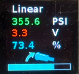
This display has the full display of information on the screen, even some that might not be strictly needed for racing.
* **Current Curve**: The current response curve is permanently displayed.
* **Pressure/Force**: The force being exerted on the sensor by the mechanism.
* **Volts**: The voltage generated by the sensor, either Volts, for pressure transducer, or milliVolts for load cells.
* **Percentage**: The percentage of the braking applied.
* **Hold Mode**: When Hold Mode is activated, the icon is displayed.
* **Progress Bar**: Percentage displayed graphically.

#### LIVE Clean
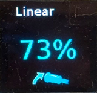
This is a display that focuses on the important.
* **Current Curve**: The current response curve is permanently displayed.
* **Percentage**: The percentage of the braking applied.
* **Hold Mode**: When Hold Mode is activated, the icon is displayed.

#### LIVE Bar
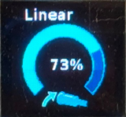
This is similar to LIVE Clean but more graphical, as it reduces the size of the numerical display of the axis percentage and adds a 270 degree circular progress bar.
* **Current Curve**: The current response curve is permanently displayed.
* **Progress Bar**: A 270 arc progress bar for the percentage of braking applied.
* **Percentage**: The percentage of the braking applied.
* **Hold Mode**: When Hold Mode is activated, the icon is displayed.

#### LIVE Dark
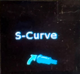
A minimalistic black screen mode that reduces distractions, glare and extends the OLED's life. It still displays the error messages, though.
* **Current Curve**: The current response curve is displayed only for 5 seconds after each change.
* **Hold Mode**: When Hold Mode is activated, the icon is displayed.

#### Error Messages
While in LIVE mode, some error codes might appear, depending on the sensor type:
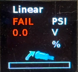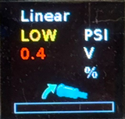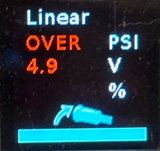

|Error|Pressure Transducer|Load Cell|
|-----|-------------------|---------|
|`FAIL`|Disconnected or electrical failure|Shorted or Wheatstone Bridge opened|
|`LOW`| Negative pressure or calibration error| Inverted polarity or negative tension|
|`OVER`|Over pressure or over voltage| N/A |

## Response Curves
The selectable response curves are designed to modify on the fly the feel in simracing and can be switched live via the rotary encoder without rebooting. Each curve alters the relationship between physical lever movement and the final HID output to match specific driving disciplines or conditions. The firmware applies the selected curve at 1000 Hz with 2-bit fractional interpolation for zero perceptible latency.

* **Linear**: 1:1 passthrough. The output is exactly proportional to the calibrated input. Use this as the baseline or in any sim where you want the hydraulic transducer to behave like a perfectly linear potentiometer.

* **Rally Soft**: Gentle initial response with progressive buildup. The curve stays flat at low pressures and steepens toward full lock. It gives maximum modulation sensitivity in the first 20–40 % of travel, ideal for rally stages where you need to feather the brake to avoid upsetting the car on loose surfaces.

* **Rally Aggressive**: Strong initial bite with early response and fine control at the top end. The opposite shape of Rally Soft: most of the output happens in the first half of the stroke, leaving the upper range for precise modulation once the car is already rotating. Perfect for aggressive rally or tarmac sections where you want instant bite without having to push the lever all the way.

* **Drift Snap**: Zero output below a configurable threshold, then immediate linear ramp. Designed for drift cars; it gives a crisp on/off feel once the brake is engaged, eliminating the mushy initial travel that hydraulic systems sometimes exhibit in drift setups.

* **Wet**: A more aggressive version of Rally Soft. Extremely soft at the bottom (almost no output until ~30 % pressure) followed by a very steep ramp. It simulates low-grip conditions (wet tarmac, gravel, snow) where the goal is to prevent lock-up while still allowing full braking power when needed.

* **S-Curve**: Soft at both extremes with a steep linear section in the middle. It optimizes sensitivity precisely where most driving happens (40–70 % brake pressure) while giving gentle engagement at the start and smooth roll-off at full lock. Many drivers find this the most “natural” curve for circuit racing or when they want one setting that works across multiple cars.

These curves were engineered from first-principles power and sigmoid functions to match real hydraulic transducer behavior observed in high-end commercial handbrakes. Because they are applied after calibration and deadzone, the physical zero and full-scale points remain unchanged; only the feel between them is modified. Experiment in practice laps — most users settle on Rally Soft for loose surfaces, Rally Aggressive for tarmac, and S-Curve for everything else.

## Main Menu Structure

1. **Hold Mode**

   In this screen you can select whether the Hold Button is handled by the game or the firmware. In the former case only the button click is sent to the game, while on the latter, the click is not sent and the axis is hold at 100%.
   
   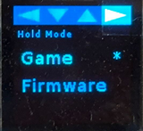

   Navigate towards the mode you want, click to set and exit with S to save or X if you want to discard your selection.

2. **Default Curve**

   Selects the default curve curve for the profile. Used at boot and at profile load time. You can set to the optimal curve if you assign a profile to a game.

   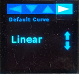

   Use the Up and Down arrows to change the curve and exit with S to save or X if you want to discard your selection..

3. **Deadzones**

   You can set the lower and upper limits of the physical travel of the lever that the system will ignore. Note that while the system will ignore those deadzones, from the movements that it will register will still cover the 0-100% range for the game to see, it will not "jump" from 0% to 5%, for example. Increase if you have dead play.

   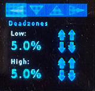

   Increase or decrease by 1% using the Up and Down arrows and by 10% by using the double arrows. Exit by S to save or X to discard.

4. **Snap Threshold**

   Selects the fraction of the axis movement (after deducting deadzones) that the Snap Drift curve will ignore. Then it goes up linearly. Is like an additional lower deadzone. The higher the threshold the snappiest the behavior.

   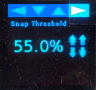

   Increase or decrease by 1% using the Up and Down arrows and by 10% by using the double arrows. Exit by S to save or X to discard.

5. **Button Debounce**

   Debounce is a time where the system ignores quick changes in the button status, to filter out electronic noise like arcs and hysteresis that generate false clicks. Increase if you are getting false clicks or double clicks. But increasing also means you have to click a bit longer to register the click.

   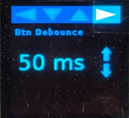

   Increase or decrease by 1% using the Up and Down arrows. Exit by S to save or X to discard.

6. **Refresh Rates**

   You set the frequency of the ADC sampling and the screen refresh. If you are getting very noisy reads you can try lowering the ADC sampling. Or if you are seeing much flickering on the screen, you can also lower the refresh rate.

   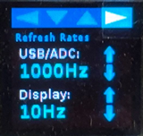

   Increase or decrease using the Up and Down arrows. Exit by S to save or X to discard.

7. **Calibrate**

   Guided routine to calibrate the actual physical limits of your handbrake. It is recommended to use it the first time you install the device and after any change or adjustment of the internals. It is specially critical if you are using a load cell sensor.

   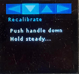

   Follow the instruction:
   1. You will be requested to first lower your handle and let it there, then click Next.
   2. The system will take its measures and display the voltage calibration, click Next or Redo to calibrate again.
   3. You will be requested to hold the handle all the way up, and click Next while holding it.
   4. Keep holding it up until the routine finishes the sampling.
   5. The system will display the read voltage, click Next or Redo to calibrate again.
   6. The system will display the zero and full RAW reads from the ADC, exit by S to save or X to discard.

8. **Language**

   Select the language you want on the interface.

   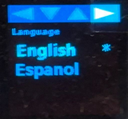

   Navigate to the language you want and click to select. Exit by S to save or X to discard.

9. **Quick Save**

   Quickly save the current state, including all parameters and even current LIVE view mode to the current profile. 

   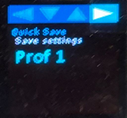

   Select the current profile and click to save.

10. **Profiles**

   You can save the current settings or load them from any of the five profile slots. Please note that the last selected profile is the one used for quick saving and will be loaded automatically each time the device starts or reboots.

   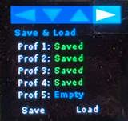

   Navigate towards the chosen profile and click to select it, then navigate towards Save or Load and click to take that action. Exit by S to keep the loaded profile or X to discard.

- **Calibration**
  - Guided routine with settling detection and outlier rejection.
  - Recommended before first session or after hardware changes.
  - Stores zero and full-scale points independently for each profile.

## Fault Detection

The firmware continuously monitors the sensor:
- Disconnected / open circuit
- Saturation / over-range
- ADC communication errors

Faults are shown on the OLED and the axis is forced to zero until resolved.

## Multi-Language

Current languages: English and Spanish.  
Additional languages are added by extending `strtable.cpp/h` and recompiling.

## Tips for Best Performance

- Always calibrate after changing transducers or mechanical setup.
- Use the 5 profiles for different cars/disciplines (e.g., rally vs. circuit vs. drift).
- Keep USB cable short and high-quality for stable 1000 Hz polling.

---

**You now have full control of the handbrake directly from the cockpit.**  
No PC software required. Ever.

For advanced customization (new curves, new ADC shims, mechanical variants) see `CONTRIBUTING.md` and `devices/README.md`.